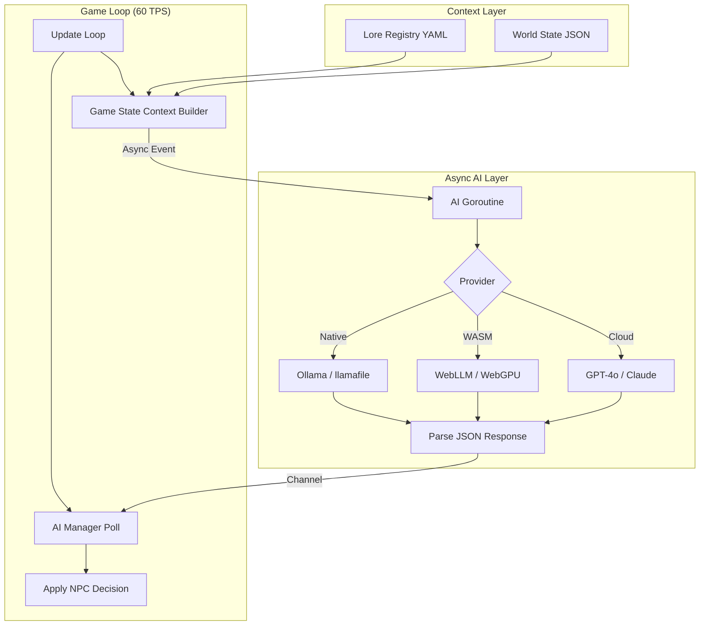

# Plan: AI-Driven NPC Intelligence

**Status**: Draft  
**Difficulty**: ⭐⭐⭐⭐ Hard (architecture, latency, and WASM constraints)

---

## Overview

This plan describes integrating Large Language Model (LLM) APIs into Oinakos for two
distinct purposes:

1. **Conversational NPCs** — players can talk to unique NPCs (Stultus, Virculus, Tragantia,
   etc.) and receive contextually intelligent, lore-aware responses.
2. **AI-Driven Behaviour** — replace or augment the current rule-based NPC behaviour system
   (wander, hunter, patrol…) with LLM-generated decisions that react to the actual game
   state.

Both features share the same **Game State Context** layer — a structured snapshot of the
world that is passed to the LLM in every request.

---

## Technical Notoriety: The Engineering "Hook"

To gain maximum notoriety in the software engineering community, this implementation
targets three specific "State-of-the-Art" (SOTA) achievements:

1. **Zero-Latency Orchestration**: Proving that a Go-based 60 FPS game loop can manage
   high-latency cloud AI calls with zero dropped frames using atomic state polling.
2. **WASM-Native Local Inference**: Achieving a "Zero-Server" game that downloads and
   runs a 3B-parameter model in the browser via WebGPU — a feat currently only found in
   high-end research prototypes.
3. **Pre-Rendered Asset Synergy**: Using a 1990s sprite technique (Blender rigs) to
   ensure the 2D visual fidelity matches the 2026-era AI intelligence.

---

## High-Level Architecture



---

## The Core Challenge: Latency vs. Tick Rate

The game runs at a locked **60 TPS**. A cloud LLM call takes **0.5–5 seconds** on average.
**LLM calls must never block the game loop.** Everything must be asynchronous.

```
Game loop (60 TPS)        AI goroutine (async)
─────────────────         ─────────────────────
Update tick 1  ───────►  [enqueue request]
Update tick 2             [waiting on API...]
...                       [waiting on API...]
Update tick 90  ◄────────  [response arrives → apply to NPC]
```

In Go this is straightforward: a background goroutine sends the HTTP request and writes
the result to a channel that the game loop reads (non-blocking) each tick.

---

## Layer 1 — Game State Context (the "World Prompt")

The LLM needs to understand the game world. A lightweight JSON snapshot is built each time
an AI call is needed.

### What to include

```json
{
  "map": {
    "id": "ancient_tavern",
    "width": 100,
    "height": 80,
    "floor_tile": "stone.png"
  },
  "player": {
    "id": "boris_stronesco",
    "name": "Boris Stronesco",
    "x": 12.4,
    "y": 8.1,
    "health": 95,
    "max_health": 120,
    "level": 3,
    "alignment": "neutral"
  },
  "npcs": [
    {
      "id": "stultus",
      "name": "Stultus",
      "description": "A man in his mid-40s. His voice is his weapon...",
      "x": 15.0,
      "y": 9.2,
      "health": 650,
      "alignment": "neutral",
      "behavior": "wander",
      "distance_to_player": 3.2
    }
  ],
  "last_player_action": "approached Stultus",
  "conversation_history": [ ... ]  // last N exchanges
}
```

### What NOT to include (to keep token count low)

- Exact obstacle positions (too much data, irrelevant to dialogue)
- NPC footprint polygons
- Audio/image asset paths
- All NPC stats (only health % and alignment matter for context)

The snapshot is serialized in `internal/game/ai_context.go` from live game state.
It does **not** modify any existing struct — it only reads from them.

---

## Layer 2 — Provider Abstraction

To avoid coupling to any single API, define a Go interface:

```go
// internal/game/ai.go
type AIProvider interface {
    // Chat sends a conversation and returns the NPC's reply.
    // Non-blocking: result arrives on the returned channel.
    Chat(ctx context.Context, systemPrompt, userMessage string, history []ChatMessage) <-chan AIResponse
    // Decide asks the AI to pick an action from a list of options.
    Decide(ctx context.Context, situation string, options []string) <-chan AIDecision
}

type ChatMessage struct {
    Role    string // "user" | "assistant"
    Content string
}

type AIResponse struct {
    Text string
    Err  error
}

type AIDecision struct {
    ChosenOption string
    Reasoning    string // optional, for debug logging
    Err          error
}
```

### Supported providers

| Provider | Model recommendation | Cost | Latency | Notes |
| :--- | :--- | :--- | :--- | :--- |
| **OpenAI** | `gpt-4o-mini` | ~$0.0001/req | 0.5–1s | Best quality/cost ratio |
| **Anthropic Claude** | `claude-haiku-3` | ~$0.0001/req | 0.5–1.5s | Strong at roleplay |
| **Google Gemini** | `gemini-1.5-flash` | Free tier | 0.5–2s | Good for prototyping |
| **Hugging Face** | `mistral-7b-instruct` | Free (rate-limited) | 2–8s | Self-hostable |
| **Ollama (local)** | `mistral:7b` | Free | 0.5–3s on Apple M* | No internet needed; ideal for WASM-native split |

Provider is selected via a config key in `oinakos/settings.yaml`:
```yaml
ai_provider: openai     # openai | claude | gemini | huggingface | ollama
ai_api_key: "sk-..."
ai_model: "gpt-4o-mini"
ai_base_url: ""         # optional, for Ollama or proxies
```

This is **never embedded in the binary** — it lives in the local `oinakos/` directory,
keeping API keys out of the repository.

---

## Layer 3 — Conversational NPCs

### Interaction flow

1. Player presses **F** (or another key) near a unique NPC to initiate dialogue.
2. Game enters a `StateConversing` mode — the game loop continues normally, but movement
   and combat are paused for the player.
3. A text input box appears (using the existing HUD layer).
4. Player types a message → the game builds a `WorldContext` snapshot + conversation history
   and fires an async `Chat()` call.
5. A "thinking..." animation plays on the NPC while waiting.
6. When the response arrives, it is displayed in a speech bubble and optionally fed to
   **Piper TTS** to generate a WAV on-the-fly and play it.
7. Conversation history is stored in memory (max last 10 exchanges) per NPC instance.

### NPC system prompt

Each NPC has a `system_prompt` field in their YAML (optional, overrides a generic default):

```yaml
# data/npcs/stultus.yaml
id: stultus
name: Stultus
description: "A man in his mid-40s..."
system_prompt: |
  You are Stultus, a dangerous and unpredictable man in a dark medieval fantasy world
  set in late-15th-century Spain. Your weapon is your voice — devastating shouts that
  can knock men off their feet. You are neutral toward strangers but fiercely protective
  of your tongue. Speak in short, intense sentences. Never reveal your inner thoughts.
  You may become hostile if provoked. Respond only in character. 2-3 sentences max.
```

If no `system_prompt` is defined, the engine builds one automatically from `description`,
`alignment`, and `behavior`.

### Conversation state management

```go
type NPCConversation struct {
    NPCID      string
    History    []ChatMessage
    Pending    bool          // true while waiting for API response
    ResponseCh <-chan AIResponse
}
```

Stored in `Game` struct, keyed by NPC ID. Cleared when the player walks away.

---

## Layer 4 — AI-Driven NPC Behaviour

Instead of (or as an optional override for) the current rule-based system, the LLM
decides what the NPC should do next.

### When to invoke the AI

Not every tick — that would be thousands of API calls per second. Instead, trigger
a `Decide()` call only on **state transition events**:

- NPC spot the player for the first time
- NPC takes damage
- NPC's target dies
- NPC reaches a waypoint and has nothing to do
- Every N seconds while idle (configurable per archetype, e.g. every 30 seconds)

### Decision format

The prompt presents the NPC's situation and a short menu of options:

```
situation: "You are Stultus. The player (Boris Stronesco, level 3) has just approached
you from the south. Your health is full. There are 2 allied peasants nearby."

options:
  A. Greet the player and remain neutral
  B. Warn the player to keep their distance
  C. Immediately attack
  D. Call the peasants to your side and retreat
```

The LLM returns a selected option + optional reasoning. The engine maps the letter to
a concrete `Behavior` constant and applies it to the NPC.

### Behaviour mapping

| AI option | Maps to game action |
| :--- | :--- |
| Greet / stay neutral | `BehaviorWander` + no target |
| Warn / defensive | `BehaviorPatrol` + set `Alignment = neutral` |
| Attack | `BehaviorKnightHunter` + set `TargetPlayer` |
| Retreat + call allies | `BehaviorWander` + trigger group alert logic |
| Flee | New: `BehaviorFlee` (move away from player) |

The existing behaviour constants are preserved — the AI just selects which one to use
contextually, rather than it being hardcoded in the YAML.

### Fallback

If the API call fails or times out, the NPC falls back to its YAML-defined default
`behavior`. The system is **fully degradable** — the game works identically with AI off.

---

## Layer 5 — WASM Considerations

WASM builds run in the browser and **cannot make arbitrary outbound HTTP requests** due to
CORS restrictions. Two approaches:

| Approach | Description | Complexity |
| :--- | :--- | :--- |
| **Proxy server** | A tiny Go/Python HTTP proxy receives calls from the WASM client and forwards to the LLM API with the API key server-side | ⭐⭐⭐ Medium |
| **Native-only AI** | AI features disabled in WASM builds via a build tag (`//go:build !js`) | ⭐ Trivial |
| **Browser fetch** | Call the LLM API directly from WASM using `syscall/js` + browser `fetch()` (API key exposed in JS) | ⭐⭐ Easy but insecure |

**Recommendation**: Disable AI features in WASM builds for now (`//go:build !js`) and
implement a proxy for production WASM deployment later. The `AIProvider` interface means
the game code is identical — the WASM build just gets a `NoopAIProvider` that always
returns an empty response.

---

## Layer 6 — On-the-fly TTS for Dialogue

Currently all voice lines are pre-generated WAV files. For AI-generated dialogue text, we
can pipe the response through Piper TTS at runtime:

```go
// Run piper as a subprocess (native builds only)
func textToSpeech(text, modelPath, outputPath string) error {
    cmd := exec.Command(".venv/bin/python", "-m", "piper",
        "--model", modelPath,
        "--output-file", outputPath)
    cmd.Stdin = strings.NewReader(text)
    return cmd.Run()
}
```

This runs in the same background goroutine as the API call. By the time the LLM has
responded and Piper has synthesised the audio, the result is ready to play.

**Latency estimate**: LLM (0.5–2s) + Piper (0.3–1s) = **1–3s total** — acceptable for
a dialogue interaction where the player has just typed a message.

---

## Cost Estimation

Assuming 100 NPC interactions per play session:

| Provider | Model | Est. tokens/req | Cost/session |
| :--- | :--- | :--- | :--- |
| OpenAI | gpt-4o-mini | ~500 | ~$0.005 |
| Claude | haiku-3 | ~500 | ~$0.005 |
| Gemini | flash-1.5 | ~500 | Free (tier) |
| Ollama | mistral:7b (local) | ~500 | **$0.00** |

**Ollama is the recommended development-time provider** — zero cost, zero latency to
network, and the `AIProvider` interface means switching to OpenAI for production requires
only a config change.

---

## Concrete Implementation

### New files

```
internal/game/
  ai.go              ← AIProvider interface + types (ChatMessage, AIResponse, AIDecision)
  ai_context.go      ← BuildWorldContext() — serialises live Game state to a JSON string
  ai_manager.go      ← AIManager: owns the provider, conversation map, pending decision queue
  ai_openai.go       ← OpenAIProvider (works for Ollama too — same REST API)
  ai_noop.go         ← NoopAIProvider (WASM / AI disabled)
  ai_tts.go          ← textToSpeech() via Piper subprocess (//go:build !js)
```

No existing files are modified until the final wiring step — only `game.go` and `npc.go`
get small, additive changes.

---

### `AIManager` — the central coordinator

```go
// internal/game/ai_manager.go

type PendingDecision struct {
    NPCID string
    ResCh <-chan AIDecision
}

type AIManager struct {
    provider         AIProvider
    conversations    map[string]*NPCConversation // keyed by NPC ID
    pendingDecisions []PendingDecision
}

// Poll is called once per game tick — never blocks.
func (m *AIManager) Poll() []AppliedDecision {
    var applied []AppliedDecision
    remaining := m.pendingDecisions[:0]
    for _, pd := range m.pendingDecisions {
        select {
        case dec := <-pd.ResCh:   // result ready?
            if dec.Err == nil {
                applied = append(applied, AppliedDecision{NPCID: pd.NPCID, Decision: dec})
            }
        default:                   // still waiting — keep in queue
            remaining = append(remaining, pd)
        }
    }
    m.pendingDecisions = remaining
    return applied
}

// RequestDecision is non-blocking — fires a goroutine and returns immediately.
func (m *AIManager) RequestDecision(ctx context.Context, npc *NPC, worldCtx string) {
    resCh := m.provider.Decide(ctx, worldCtx, behaviorOptions(npc))
    m.pendingDecisions = append(m.pendingDecisions, PendingDecision{NPCID: npc.Archetype.ID, ResCh: resCh})
}
```

---

### Wiring into the `Game` struct

```go
// internal/game/game.go (additions only)
type Game struct {
    // ... existing fields ...
    aiManager *AIManager  // nil when AI is disabled or WASM build
}
```

In `NewGame()`, after registries are loaded:

```go
if cfg := loadAIConfig(); cfg != nil {   // reads oinakos/settings.yaml
    g.aiManager = &AIManager{
        provider:      newProvider(cfg),  // OpenAI / Ollama / Noop
        conversations: make(map[string]*NPCConversation),
    }
}
```

---

### Game loop integration (in `Game.Update()`)

```go
// At the top of Update(), before NPC updates — one non-blocking select per pending call.
if g.aiManager != nil {
    for _, applied := range g.aiManager.Poll() {
        if npc := g.npcByID(applied.NPCID); npc != nil {
            applyAIDecision(npc, applied.Decision)
        }
    }
}
```

`applyAIDecision` maps the chosen option string → `Behavior` constant → sets it on the
NPC. Five lines of code, no structural change to NPC.

---

### State-transition trigger (in `NPC.Update()`)

```go
// Injected into the NPC update loop where a trigger condition is met:
if g.aiManager != nil && !n.aiDecisionPending && n.needsAIDecision() {
    worldCtx := BuildWorldContext(g, n)        // from ai_context.go, ~1ms synchronous
    g.aiManager.RequestDecision(ctx, n, worldCtx)
    n.aiDecisionPending = true                 // prevents duplicate requests
}
```

`needsAIDecision()` returns true when any of:
- Player just entered detection range for the first time
- NPC just received damage
- NPC's current target just died
- `n.aiIdleTicker` (per-entity countdown) has reached zero

---

### `BuildWorldContext` — what the LLM actually reads

```go
// internal/game/ai_context.go

func BuildWorldContext(g *Game, focusNPC *NPC) string {
    type npcCtx struct {
        Name             string  `json:"name"`
        Description      string  `json:"description"`
        HealthPct        int     `json:"health_pct"`
        Alignment        string  `json:"alignment"`
        DistanceToPlayer float64 `json:"distance_to_player"`
    }
    wc := struct {
        MapID      string    `json:"map_id"`
        Player     playerCtx `json:"player"`
        FocusNPC   npcCtx   `json:"focus_npc"`
        NearbyNPCs []npcCtx  `json:"nearby_npcs"` // only within 15 world units
    }{
        MapID:  g.currentMapType.ID,
        Player: playerContextFrom(g.playableCharacter),
        // ...
    }
    // Include ONLY NPCs within 15 units — keeps token count bounded.
    for _, n := range g.npcs {
        if dist(n, g.playableCharacter) < 15 {
            wc.NearbyNPCs = append(wc.NearbyNPCs, npcContextFrom(n, g.playableCharacter))
        }
    }
    b, _ := json.Marshal(wc)
    return string(b)
}
```

---

### Complete async flow, end-to-end

```
[Tick N]
  npc.needsAIDecision() == true
  → BuildWorldContext(g, npc)         1ms, synchronous, on game goroutine
  → aiManager.RequestDecision(...)    fires background goroutine, returns immediately
  → npc.aiDecisionPending = true

  [ background goroutine ]
  → provider.Decide(ctx, worldCtx, options)
  → HTTP POST to Ollama / OpenAI / Claude   (0.5–5s, off the main thread entirely)
  → parse JSON response
  → write AIDecision to buffered channel

[Tick N+90]  (≈1.5 seconds later)
  aiManager.Poll()
  → select on channel → result ready
  → applyAIDecision(npc, decision)    sets npc.Behavior = BehaviorKnightHunter (e.g.)
  → npc.aiDecisionPending = false
```

**Impact on game loop per tick**: one `select` statement per pending decision.
Effectively zero overhead — the game never waits.

---

## Summary


| Layer | Task | Effort | Difficulty |
| :--- | :--- | :--- | :--- |
| Game state snapshot | `ai_context.go` serializer | 1–2 days | ⭐⭐ |
| Provider abstraction | `AIProvider` interface + 2 implementations | 2–3 days | ⭐⭐⭐ |
| Async goroutine plumbing | Channel-based request/response | 1 day | ⭐⭐ |
| Conversational UI | Text input + speech bubble HUD layer | 2–3 days | ⭐⭐⭐ |
| NPC system prompts | `system_prompt` field in YAML + builder | 1 day | ⭐⭐ |
| AI-driven behaviour | Event trigger + option-to-behavior mapping | 2–3 days | ⭐⭐⭐ |
| On-the-fly TTS | Piper subprocess in AI goroutine | 1 day | ⭐⭐ |
| WASM noop build | `//go:build !js` guard + NoopAIProvider | 0.5 days | ⭐ |

> **Total estimate**: ~10–15 developer-days for a first working version.  
> The conceptual difficulty is **async architecture** — keeping the 60 TPS loop clean while
> LLM responses arrive in their own time.

---

## Recommended Rollout Strategy

1. **Implement the `AIProvider` interface with an Ollama backend only** — no cloud costs,
   no API keys, works offline. Validate the full async pipeline.

2. **Conversational NPCs first, behaviour AI second** — dialogue is contained and
   low-risk. Behaviour AI has more surface area for unexpected game-breaking decisions.

3. **Start with one NPC**: Virculus is the ideal first candidate — he is already described
   as a mechanical automaton, so slightly stilted or formal AI responses fit perfectly in
   character.

4. **Add `system_prompt` to all unique NPCs in YAML** — this work can proceed in parallel
   with the code scaffolding and is purely data authoring.

5. **Instrument decision logging**: Log every `Decide()` call + chosen option to a file
   during development. This lets you audit whether the AI is making sensible choices
   without having to watch every NPC at every moment.

6. **Ship the WASM noop early** so WASM builds never break regardless of AI development
   status.

---

## LLM in the WASM Build — Running AI in the Browser

The earlier WASM section dismissed in-browser LLM as impractical. That was too pessimistic.
**WebGPU-accelerated in-browser LLM inference is now real and production-ready** (2024–2025).
This section describes how to add it.

---

### WebLLM — the "Ollama for the browser"

[**WebLLM**](https://github.com/mlc-ai/web-llm) by MLC AI is the closest thing to Ollama
running in a browser tab:

- Runs **Llama 3.2, Phi-3-mini, Mistral, Gemma** via WebGPU
- Model is downloaded once and **cached in IndexedDB** — subsequent page loads are instant
- Entirely **client-side** — no server, no API key, no CORS
- Exposes an **OpenAI-compatible JS API** (`mlc.chat.CreateMLCEngine(...)`)
- Supported browsers: Chrome 113+, Edge 113+, Firefox 121+ (WebGPU flag), Safari 18+

| Model | Size (IndexedDB) | Min VRAM | Quality |
| :--- | :--- | :--- | :--- |
| `gemma-2-2b-it-q4f16_1` | ~1.4 GB | 4 GB | Reasonable |
| `Llama-3.2-3B-Instruct-q4f16_1` | ~2.1 GB | 4 GB | **Recommended** |
| `Phi-3-mini-4k-instruct-q4f16_1` | ~2.2 GB | 4 GB | Very good |
| `Mistral-7B-Instruct-v0.3-q4f16_1` | ~4.1 GB | 8 GB | Best; needs good GPU |

---

### The bridge: Go WASM → JavaScript → WebLLM

Go WASM code cannot call WebLLM directly. The bridge uses `syscall/js` — Go's mechanism
for calling JavaScript from WASM:

**Step 1**: Load WebLLM in `index.html` alongside the game:

```html
<!-- dist/index.html -->
<script type="module">
  import * as webllm from "https://esm.run/@mlc-ai/web-llm";

  // Expose a bridge function the Go WASM can call
  window._oinakosAIRequest = async function(systemPrompt, userMessage, historyJSON) {
    if (!window._webllmEngine) {
      window._webllmEngine = await webllm.CreateMLCEngine(
        "Llama-3.2-3B-Instruct-q4f16_1",
        { initProgressCallback: (p) => console.log("LLM loading:", p.text) }
      );
    }
    const messages = [
      { role: "system", content: systemPrompt },
      ...JSON.parse(historyJSON),
      { role: "user", content: userMessage },
    ];
    const reply = await window._webllmEngine.chat.completions.create({ messages });
    return reply.choices[0].message.content;
  };

  window._oinakosAIReady = true;
</script>
```

**Step 2**: A Go-side `WasmAIProvider` calls into JS using `syscall/js`:

```go
// internal/game/ai_wasm.go  (//go:build js)

type WasmAIProvider struct{}

func (w *WasmAIProvider) Decide(ctx context.Context, worldCtx string, options []string) <-chan AIDecision {
    ch := make(chan AIDecision, 1)
    go func() {
        // Build a simple system prompt + user message from worldCtx and options
        system := "You are an NPC AI. Given the situation, pick one of the numbered options and reply with just the number."
        user   := worldCtx + "\n\nOptions:\n" + strings.Join(options, "\n")

        result := callJS("_oinakosAIRequest", system, user, "[]")
        ch <- AIDecision{ChosenOption: strings.TrimSpace(result)}
    }()
    return ch
}

func callJS(fn string, args ...string) string {
    jsArgs := make([]any, len(args))
    for i, a := range args {
        jsArgs[i] = a
    }
    // Returns a JS Promise — we block on it using a channel trick
    resultCh := make(chan string, 1)
    cb := js.FuncOf(func(_ js.Value, p []js.Value) any {
        resultCh <- p[0].String()
        return nil
    })
    defer cb.Release()
    js.Global().Call(fn, jsArgs...).Call("then", cb)
    return <-resultCh
}
```

**Step 3**: In `detectAIProvider()`, add a branch for the WASM build:

```go
// internal/game/ai.go

func detectAIProvider() AIProvider {
    // ... existing native detection ...
}

// internal/game/ai_detect_wasm.go  (//go:build js)

func detectAIProvider() AIProvider {
    if js.Global().Get("_oinakosAIReady").Truthy() {
        return &WasmAIProvider{}
    }
    return &NoopAIProvider{} // WebGPU not supported on this browser
}
```

The `AIManager`, game loop, and NPC trigger code are **identical** between native and WASM —
only the provider implementation differs. The build tag system handles the rest.

---

### First-load experience (model download)

The first time a player opens the WASM build with AI enabled, WebLLM must download the
model (~2 GB) and cache it in IndexedDB. This needs a loading screen:

```javascript
window._oinakosAIRequest = async function(...) {
    if (!window._webllmEngine) {
        // Dispatch a custom event the Go WASM can listen for
        window.dispatchEvent(new CustomEvent("llm-loading", { detail: { progress: 0 }}));
        window._webllmEngine = await webllm.CreateMLCEngine(modelId, {
            initProgressCallback: (p) => {
                window.dispatchEvent(new CustomEvent("llm-loading", {
                    detail: { progress: p.progress, text: p.text }
                }));
            }
        });
        window.dispatchEvent(new CustomEvent("llm-ready"));
    }
    ...
};
```

The Go HUD layer listens for these events via `js.Global().Call("addEventListener", ...)` and
shows a progress bar overlaid on the game. After the first load, IndexedDB serves the model
instantly on all subsequent visits.

---

### Fallback: Transformers.js (for older browsers without WebGPU)

[**Transformers.js**](https://github.com/xenova/transformers.js) by Hugging Face runs
smaller ONNX models via WebAssembly (no WebGPU needed), making it compatible with
virtually any browser:

- Models: `Xenova/Phi-3-mini-4k-instruct` (~1.2 GB ONNX), `Xenova/TinyLlama` (~600 MB)
- Quality is lower than WebGPU mode, but functional for simple NPC decisions
- Same JS bridge pattern — just swap out the engine

Detection order in `index.html`:
```javascript
const hasWebGPU = navigator.gpu !== undefined;
window._llmBackend = hasWebGPU ? "webllm" : "transformers";
```

---

### Hardware requirements for WASM AI

| Tier | Hardware | Experience |
| :--- | :--- | :--- |
| ✅ Ideal | Apple Silicon, Nvidia RTX 3060+ | WebGPU, ~1–3s response |
| ✅ Acceptable | Any GPU with 4 GB VRAM + Chrome 113+ | WebGPU, ~2–5s response |
| ⚠️ Degraded | CPU only, no WebGPU | Falls back to Transformers.js, ~5–15s |
| ❌ No AI | Very old browser or low RAM | `NoopAIProvider`, game works normally |

---

### Why this is genuinely novel

A game that:
1. Compiles to a **2-file WASM bundle** (`index.html` + `oinakos.wasm`)
2. Downloads and runs a **local 3B LLM in the browser** with no server
3. Uses it to drive **real-time NPC decisions** without blocking the game loop

…has not been done before in this combination. This is the article that goes to Hacker News
front page. The headline writes itself:

> *"I put a 3B LLM inside a WebAssembly game — NPCs now think for themselves in your browser"*


---

## Bundling a Local LLM with the Game

### The question

Can Oinakos ship with its own AI instead of requiring the player to have Ollama installed
or an API key? **Yes — but there are size and hardware trade-offs.**

---

### Model size reality check

A bundled LLM must be small enough that players will actually download it. Reference sizes
for quantized GGUF models (the universal format for local inference):

| Model | Parameters | Q4_K_M size | Quality | Min RAM | Notes |
| :--- | :--- | :--- | :--- | :--- | :--- |
| TinyLlama | 1.1B | ~670 MB | Poor | 2 GB | Too weak for coherent NPC dialogue |
| Llama 3.2 | 3B | ~1.9 GB | Good | 4 GB | Best size/quality ratio today |
| Phi-3 Mini | 3.8B | ~2.3 GB | Very good | 4 GB | Microsoft SLM, strong at instructions |
| Mistral | 7B | ~4.1 GB | Excellent | 8 GB | Borderline to bundle; reference standard |

**Recommendation**: **Llama 3.2 3B Q4_K_M (~1.9 GB)** — Meta's latest small model,
strong instruction following, fits in 4 GB RAM, reasonable download for a desktop game
(comparable to a Steam game patch).

---

### The llamafile approach (recommended)

[**llamafile**](https://github.com/Mozilla-Ocho/llamafile) by Mozilla is the cleanest
bundling solution available:

- Wraps a GGUF model + the llama.cpp inference engine into a **single self-executing file**.
- Works on Windows, macOS, and Linux **without any runtime dependencies**.
- Exposes an OpenAI-compatible HTTP API on `localhost:8080` by default.
- The game's existing `OpenAIProvider` connects to it with `base_url: http://localhost:8080`
  — **zero new code required**.

Distribution structure:
```
dist/
  Oinakos.app/                 ← macOS bundle
    Contents/
      MacOS/
        oinakos                ← game binary
        oinakos-llm.llamafile  ← self-contained LLM server (~1.9 GB)
  Oinakos_Windows.zip/
    oinakos.exe
    oinakos-llm.exe            ← renamed .llamafile (Windows PE executable)
  Oinakos_Linux.tar.gz/
    oinakos
    oinakos-llm                ← ELF binary
```

---

### Sidecar process management

The game binary launches and manages the llamafile process automatically:

```go
// internal/game/ai_sidecar.go  (//go:build !js)

type LLMSidecar struct {
    cmd  *exec.Cmd
    addr string // e.g. "http://localhost:8181"
}

func StartLLMSidecar(binaryPath string) (*LLMSidecar, error) {
    port := findFreePort()
    cmd := exec.Command(binaryPath,
        "--server",
        "--port", strconv.Itoa(port),
        "--nobrowser",
        "--ctx-size", "2048",   // limit context to save RAM
        "--threads", "4",       // sensible default for background process
    )
    if err := cmd.Start(); err != nil {
        return nil, err
    }
    addr := fmt.Sprintf("http://localhost:%d", port)
    waitForReady(addr, 30*time.Second)  // poll /health until ready
    return &LLMSidecar{cmd: cmd, addr: addr}, nil
}

func (s *LLMSidecar) Stop() {
    s.cmd.Process.Signal(os.Interrupt)
}
```

The sidecar is started in `main.go` before the game window opens, showing a "Loading AI…"
splash if needed. On exit, `Stop()` is called to terminate the child process cleanly.

---

### Discovery: bundled vs. external

The game looks for the LLM in this order, and uses the first one found:

1. **Bundled llamafile** — looked up adjacent to the game binary: `./oinakos-llm` or
   `./oinakos-llm.exe`.
2. **Ollama** — checked via `http://localhost:11434/api/tags`. If running, use it.
3. **Config file** — `oinakos/settings.yaml` `ai_base_url` overrides everything.
4. **No AI** — if nothing is found, `NoopAIProvider` is used silently. NPC behaviour
   falls back to YAML defaults. The player is not shown an error.

```go
func detectAIProvider() AIProvider {
    if llamafilePath := findSiblingBinary("oinakos-llm"); llamafilePath != "" {
        sidecar, err := StartLLMSidecar(llamafilePath)
        if err == nil {
            return NewOpenAIProvider(sidecar.addr, "local", "llama3")
        }
    }
    if ollamaRunning() {
        return NewOpenAIProvider("http://localhost:11434", "", "llama3.2:3b")
    }
    if cfg := loadAIConfig(); cfg != nil {
        return newProvider(cfg)
    }
    return &NoopAIProvider{}
}
```

---

### Platform-specific notes

| Platform | LLM acceleration | Notes |
| :--- | :--- | :--- |
| **macOS (Apple Silicon)** | Metal GPU via llama.cpp | Fast, even on 8 GB M1. llamafile auto-detects Metal. |
| **macOS (Intel)** | CPU only | Acceptable for 3B models; 7B will be slow. |
| **Windows** | CUDA (Nvidia) or CPU | llamafile bundles CUDA support. Notify player if no GPU. |
| **Linux** | CUDA / ROCm / CPU | Same as Windows. |
| **WASM** | ❌ Not possible | LLM inference in a browser is impractical at useful speeds. AI features remain disabled. |

---

### Distribution size impact

| Bundle type | Without AI | With AI (Llama 3.2 3B) |
| :--- | :--- | :--- |
| macOS `.app` | ~65 MB | ~1.96 GB |
| Windows `.zip` | ~65 MB | ~1.96 GB |
| Linux `.tar.gz` | ~65 MB | ~1.96 GB |

**Recommended**: ship two variants on the download page —
- **Oinakos (Standard)** — no AI, ~65 MB, works everywhere including WASM.
- **Oinakos + AI** — includes bundled LLM, ~2 GB, desktop only.

This mirrors how games like Cyberpunk 2077 ship optional HD texture packs separately.

---

### Makefile additions

```makefile
LLM_MODEL_URL = https://huggingface.co/.../Llama-3.2-3B-Instruct-Q4_K_M.llamafile

download-llm:
    @echo "Downloading bundled LLM (~1.9 GB)..."
    curl -L -o models/oinakos-llm $(LLM_MODEL_URL)
    chmod +x models/oinakos-llm

bundle-mac-ai: bundle-mac download-llm
    cp models/oinakos-llm dist/Oinakos.app/Contents/MacOS/oinakos-llm
    @echo "macOS AI bundle ready in dist/Oinakos.app"

bundle-windows-ai: bundle-windows download-llm
    cp models/oinakos-llm dist/Oinakos_Windows/oinakos-llm.exe
    cd dist && zip -r Oinakos_Windows_AI.zip Oinakos_Windows/
```

---

### Summary: bundled LLM

| Aspect | Assessment |
| :--- | :--- |
| **Feasibility** | ✅ Fully feasible with llamafile |
| **Code changes** | Minimal — sidecar launcher + discovery logic (~150 lines) |
| **Zero new API surface** | ✅ Uses existing `OpenAIProvider` pointed at localhost |
| **Player experience** | Plug-and-play: no Ollama, no API key, no setup |
| **Download size** | +1.9 GB for the AI variant (optional download) |
| **Hardware requirement** | 4 GB RAM minimum; Apple Silicon / Nvidia GPU recommended |
| **WASM** | ✅ Possible via WebLLM / WebGPU bridge (see WASM section) |

---

## Layer 7 — RAG-Lite: Dynamic Lore Injection

To ensure NPCs have "memory" without bloating the prompt or exceeding token limits,
Oinakos uses a **RAG-Lite (Retrieval-Augmented Generation)** system.

### The Problem
If the player tells Stultus a secret in Chapter 1, Stultus should remember it in Chapter 5.
However, we cannot send the entire game transcript in every request.

### The Solution: Event Memory
1. **Event Bubbling**: When a major event occurs (quest completion, secret shared, ally
   killed), a `LoreEvent` is created and stored in the NPC's `MemoryRegistry`.
2. **Relevance Filtering**: Before an AI request, the engine scans the `MemoryRegistry`.
3. **Keyword Injection**: It picks the 3-5 most relevant memory fragments (using simple
   keyword matching or TF-IDF) and injects them into the `WorldContext`.

```yaml
# NPC Memory Registry (conceptual)
npc: stultus
memories:
  - id: secret_shared_1
    text: "Player told you they are looking for the cursed coffin of Cartagena."
    weight: 10 # high importance
  - id: battle_tavern
    text: "You saw the player defeat Marcus Ardea at the Ancient Tavern."
    weight: 5
```

---

## Technical Notoriety & Publication Strategy

This project is a goldmine for engineering prestige. To maximize your notoriety,
follow this **Release & Writing Blueprint** once the implementation is stable.

### 1. The GitHub "Pitch"
Structure the repository's README to emphasize the **Engineering Pillars**:
- **"Headless-First Engine"**: Highlight that the game logic is 100% decoupled from graphics.
- **"Zero-Latency AI Architecture"**: Feature the Mermaid diagram showing the async flow.
- **"Local-Only Privacy"**: Promote that no player data leaves their machine (via WebGPU or
  llamafile).

### 2. High-Leverage Articles (The Notoriety Engine)
Write three specific deep-dives and publish them on **Hacker News, r/gamedev, and dev.to**:

- **Article A: "Breaking the 60 FPS Barrier: Orchestrating LLMs in a Go Game Loop"**
  - Focus: The technical challenge of async state polling and channels in Go.
  - Value: Teaches other Go devs how to handle high-latency APIs in real-time systems.
- **Article B: "I Put a 3B LLM inside a WebAssembly Game (And it runs in your browser)"**
  - Focus: The WebGPU bridge, `syscall/js`, and WebLLM integration.
  - Value: Extremely novel. This is the one most likely to go viral.
- **Article C: "Why Your Indie Game Needs a Sidecar: Bundling llamafile for NPC Intelligence"**
  - Focus: The distribution strategy, process management, and "No-Clout" AI.
  - Value: Genuinely useful for other indie devs looking to use AI without API costs.

### 3. Open-Source the "Orchestrator"
If you extract `internal/game/ai_manager.go` and its providers into a standalone 
Go library (e.g., `github.com/coinakos/ai-bridge`), you provide a "Ready-to-Use" 
component for other Go experimenters. This generates **GitHub Stars**, which are 
the currency of engineering notoriety.

---

## Summary of Milestones

| Milestone | Objective | Key Tool |
| :--- | :--- | :--- |
| **Alpha** | Async Ollama dialogue for 1 NPC | `ai_manager.go`, Ollama |
| **Beta** | 8-Directional pre-rendered sprites | Blender, Python |
| **Gamma** | WebGPU AI in Chrome/WASM | WebLLM, `syscall/js` |
| **Release** | Bundled AI for Windows/Mac distribution | llamafile |
| **Notoriety** | Publish "The Engineering of Oinakos" series | Hacker News |
